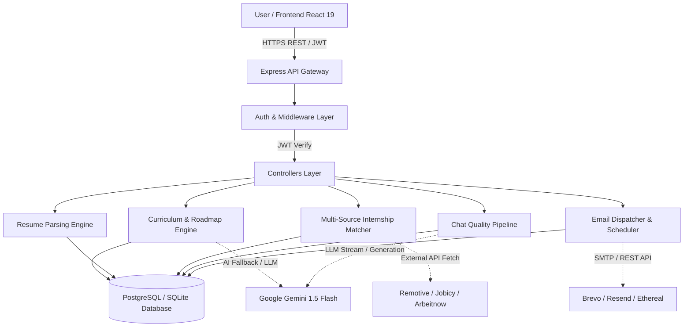

# CareerPilot AI — Complete Technical Documentation & Presentation Guide

---

## 1. Database Schema & Entity-Relationship (ER) Model

The database is powered by **PostgreSQL** (production on Render/Supabase with SSL) with an automated **SQLite** file-backed fallback (`data/careerpilot.sqlite`). All 10 tables are automatically verified and initialized at startup via `initDB()` in `backend/src/config/db.js`.

### 1.1 Tables & Column Definitions

```
+------------------------------------------------------------------------------------+
|                                    USERS                                           |
+------------------------------------+-----------------------------------------------+
| Column                             | Type & Constraints                           |
+------------------------------------+-----------------------------------------------+
| id                                 | VARCHAR(64) PRIMARY KEY (UUID v4)             |
| google_id                          | VARCHAR(128) UNIQUE                           |
| email                              | VARCHAR(255) UNIQUE NOT NULL                  |
| name                               | VARCHAR(255) NOT NULL                         |
| avatar_url                         | TEXT                                          |
| target_role                        | VARCHAR(255)                                  |
| dream_companies                    | TEXT                                          |
| current_skills                     | TEXT (Comma-separated string)                 |
| skills_inventory                   | TEXT (JSON array of structured skills)        |
| daily_study_hours                  | INTEGER DEFAULT 2                             |
| available_study_minutes            | INTEGER DEFAULT 120                           |
| university_name                    | VARCHAR(255)                                  |
| branch                             | VARCHAR(255)                                  |
| phone_number                       | VARCHAR(50)                                   |
| preferred_language                 | VARCHAR(10) DEFAULT 'en' (en, hi, mr, sa)     |
| email_notifications_enabled        | BOOLEAN DEFAULT TRUE                          |
| email_consent_granted_at           | TIMESTAMP                                     |
| is_onboarded                       | BOOLEAN DEFAULT FALSE                         |
| created_at                         | TIMESTAMP DEFAULT CURRENT_TIMESTAMP           |
+------------------------------------+-----------------------------------------------+

+------------------------------------------------------------------------------------+
|                                   RESUMES                                          |
+------------------------------------+-----------------------------------------------+
| id                                 | VARCHAR(64) PRIMARY KEY (UUID v4)             |
| user_id                            | VARCHAR(64) NOT NULL (FK -> users.id)         |
| file_url                           | TEXT                                          |
| ai_feedback                        | TEXT (JSON of ATS score & recommendations)    |
| score                              | INTEGER DEFAULT 0                             |
| uploaded_at                        | TIMESTAMP DEFAULT CURRENT_TIMESTAMP           |
+------------------------------------+-----------------------------------------------+

+------------------------------------------------------------------------------------+
|                                  ROADMAPS                                          |
+------------------------------------+-----------------------------------------------+
| id                                 | VARCHAR(64) PRIMARY KEY (UUID v4)             |
| user_id                            | VARCHAR(64) NOT NULL (FK -> users.id)         |
| skill_name                         | VARCHAR(255) NOT NULL                         |
| duration_weeks                     | INTEGER DEFAULT 4                             |
| daily_hours                        | INTEGER DEFAULT 2                             |
| target_role                        | VARCHAR(255)                                  |
| status                             | VARCHAR(50) DEFAULT 'active'                  |
| created_at                         | TIMESTAMP DEFAULT CURRENT_TIMESTAMP           |
+------------------------------------+-----------------------------------------------+

+------------------------------------------------------------------------------------+
|                               ROADMAP_TASKS                                        |
+------------------------------------+-----------------------------------------------+
| id                                 | VARCHAR(64) PRIMARY KEY (UUID v4)             |
| roadmap_id                         | VARCHAR(64) NOT NULL (FK -> roadmaps.id)      |
| week_number                        | INTEGER NOT NULL                              |
| day_number                         | INTEGER NOT NULL                              |
| task_description                   | TEXT NOT NULL                                 |
| resource_links                     | TEXT (JSON array of verified URLs)            |
| is_completed                       | BOOLEAN DEFAULT FALSE                         |
| status                             | VARCHAR(20) DEFAULT 'planned'                 |
| completed_at                       | TIMESTAMP                                     |
+------------------------------------+-----------------------------------------------+

+------------------------------------------------------------------------------------+
|                                    PLANS                                           |
+------------------------------------+-----------------------------------------------+
| id                                 | VARCHAR(64) PRIMARY KEY (UUID v4)             |
| user_id                            | VARCHAR(64) NOT NULL (FK -> users.id)         |
| plan_type                          | VARCHAR(50) DEFAULT 'weekly'                  |
| start_date                         | DATE                                          |
| end_date                           | DATE                                          |
| tasks                              | TEXT (JSON array of daily time slots)         |
| ai_suggestions                     | TEXT (JSON pros/cons & optimization)          |
| is_edited_by_user                  | BOOLEAN DEFAULT FALSE                         |
+------------------------------------+-----------------------------------------------+

+------------------------------------------------------------------------------------+
|                                CHAT_SESSIONS                                       |
+------------------------------------+-----------------------------------------------+
| id                                 | VARCHAR(64) PRIMARY KEY (UUID v4)             |
| user_id                            | VARCHAR(64) NOT NULL (FK -> users.id)         |
| title                              | VARCHAR(255) NOT NULL                         |
| created_at                         | TIMESTAMP DEFAULT CURRENT_TIMESTAMP           |
| updated_at                         | TIMESTAMP DEFAULT CURRENT_TIMESTAMP           |
+------------------------------------+-----------------------------------------------+

+------------------------------------------------------------------------------------+
|                                CHAT_MESSAGES                                       |
+------------------------------------+-----------------------------------------------+
| id                                 | VARCHAR(64) PRIMARY KEY (UUID v4)             |
| session_id                         | VARCHAR(64) NOT NULL (FK -> chat_sessions.id) |
| user_id                            | VARCHAR(64) NOT NULL (FK -> users.id)         |
| sender                             | VARCHAR(20) NOT NULL ('user' | 'assistant')   |
| text                               | TEXT NOT NULL                                 |
| attachment_name                    | VARCHAR(255)                                  |
| attachment_type                    | VARCHAR(100)                                  |
| created_at                         | TIMESTAMP DEFAULT CURRENT_TIMESTAMP           |
+------------------------------------+-----------------------------------------------+

+------------------------------------------------------------------------------------+
|                                    GOALS                                           |
+------------------------------------+-----------------------------------------------+
| id                                 | VARCHAR(64) PRIMARY KEY (UUID v4)             |
| user_id                            | VARCHAR(64) NOT NULL (FK -> users.id)         |
| goal_description                   | TEXT NOT NULL                                 |
| target_date                        | DATE                                          |
| progress_percentage                | INTEGER DEFAULT 0                             |
| status                             | VARCHAR(50) DEFAULT 'active'                  |
+------------------------------------+-----------------------------------------------+

+------------------------------------------------------------------------------------+
|                                  EMAIL_LOGS                                        |
+------------------------------------+-----------------------------------------------+
| id                                 | VARCHAR(64) PRIMARY KEY (UUID v4)             |
| user_id                            | VARCHAR(64) NOT NULL (FK -> users.id)         |
| email_to                           | VARCHAR(255) NOT NULL                         |
| email_type                         | VARCHAR(50) NOT NULL (welcome/goal/inactivity)|
| subject                            | TEXT NOT NULL                                 |
| status                             | VARCHAR(50) DEFAULT 'delivered'               |
| provider                           | VARCHAR(50) DEFAULT 'system'                  |
| preview_url                        | TEXT                                          |
| sent_at                            | TIMESTAMP DEFAULT CURRENT_TIMESTAMP           |
+------------------------------------+-----------------------------------------------+

+------------------------------------------------------------------------------------+
|                              EMAIL_PREFERENCES                                     |
+------------------------------------+-----------------------------------------------+
| user_id                            | VARCHAR(64) PRIMARY KEY (FK -> users.id)       |
| consent_granted                    | BOOLEAN DEFAULT TRUE                          |
| welcome_enabled                    | BOOLEAN DEFAULT TRUE                          |
| goal_enabled                       | BOOLEAN DEFAULT TRUE                          |
| reminder_enabled                   | BOOLEAN DEFAULT TRUE                          |
| progress_enabled                   | BOOLEAN DEFAULT TRUE                          |
| updated_at                         | TIMESTAMP DEFAULT CURRENT_TIMESTAMP           |
+------------------------------------+-----------------------------------------------+
```

### 1.2 Entity Relationships

- `users (1) ───< resumes (N)` : One user uploads multiple resumes over time.
- `users (1) ───< roadmaps (N)` : One user can generate roadmaps for multiple domains.
- `roadmaps (1) ───< roadmap_tasks (N)` : Each roadmap has $N \times 7$ daily structured tasks.
- `users (1) ───< plans (N)` : One user creates weekly co-planner schedules.
- `users (1) ───< chat_sessions (N)` : One user can organize discussions into multiple chat threads.
- `chat_sessions (1) ───< chat_messages (N)` : Each session contains sequential conversational messages.
- `users (1) ───< goals (N)` : One user tracks multiple career milestones.
- `users (1) ───< email_logs (N)` : Audit log of all dispatched notification emails.
- `users (1) ───- email_preferences (1)` : One-to-one user notification consent and toggle settings.

---

## 2. Modules, API Routes, and Libraries

### 2.1 Backend Libraries & Purpose
| Library | Version | Purpose |
| :--- | :--- | :--- |
| `express` | `^4.21.2` | Core HTTP web framework and REST API routing |
| `@google/generative-ai` | `^0.24.0` | Official Google Gemini SDK for Gemini 1.5 Flash models |
| `pg` | `^8.13.3` | PostgreSQL client with SSL connection pool support |
| `sqlite3` | `^5.1.7` | Local zero-configuration database engine fallback |
| `jsonwebtoken` | `^9.0.2` | Stateless HMAC-SHA256 JWT generation and verification |
| `google-auth-library` | `^9.15.1` | Google OAuth2 ID Token cryptographic signature verification |
| `multer` | `^1.4.5-lts.1` | Multipart/form-data handler for PDF and DOCX resume uploads |
| `pdf-parse` | `^1.1.1` | In-memory raw text extraction from binary PDF resumes |
| `mammoth` | `^1.9.0` | Raw text and structure extraction from `.docx` files |
| `nodemailer` | `^6.10.0` | SMTP email dispatcher (Brevo, Resend, Gmail, Ethereal) |
| `dotenv` | `^16.4.7` | Environment variable loader from `.env` files |
| `cors` | `^2.8.5` | Cross-Origin Resource Sharing middleware |
| `uuid` | `^11.1.0` | RFC4122 v4 unique identifier generator |

### 2.2 Frontend Libraries & Purpose
| Library | Version | Purpose |
| :--- | :--- | :--- |
| `react` | `^19.0.0` | Component-based modern UI rendering engine |
| `react-router-dom` | `^6.28.1` | Client-side routing and protected view guards |
| `tailwindcss` | `^3.4.17` | Utility-first responsive dark glassmorphism styling |
| `lucide-react` | `^0.475.0` | Accessible iconography system |
| `jspdf` | `^2.5.2` | Client-side PDF export generation for roadmaps and plans |
| `canvas-confetti` | `^1.9.4` | Milestone celebration visual effects |
| `vite` | `^6.1.0` | High-speed frontend build tool and development server |

### 2.3 API Route Registry
| Method | Endpoint | Auth | Purpose |
| :--- | :--- | :---: | :--- |
| `POST` | `/api/auth/google` | Public | Verify Google ID token, upsert user, return JWT |
| `POST` | `/api/auth/demo` | Public | Instant demo login as Aarav Sharma with seeded profile |
| `POST` | `/api/auth/onboarding` | Required | Complete user onboarding preferences and target role |
| `GET` | `/api/auth/me` | Required | Fetch authenticated user profile and verification status |
| `PUT` | `/api/user/profile` | Required | Update university, branch, dream companies, study time |
| `GET` | `/api/user/skills` | Required | Retrieve verified skills vault from profile + resume |
| `PUT` | `/api/user/skills` | Required | Update structured verified skills inventory |
| `POST` | `/api/resume/analyze` | Required | Upload PDF/DOCX, parse text, calculate ATS score & issues |
| `GET` | `/api/resume/latest` | Required | Retrieve latest uploaded resume and AI feedback |
| `POST` | `/api/roadmap/generate` | Required | Generate full curriculum roadmap with 0 duplicate modules |
| `POST` | `/api/roadmap/adapt` | Required | Adapt remaining weeks on goal/level change without reset |
| `GET` | `/api/roadmap` | Required | Fetch all user roadmaps with completed task statistics |
| `PUT` | `/api/roadmap/tasks/:id/toggle` | Required | Toggle daily task completion and persist progress % |
| `PUT` | `/api/roadmap/tasks/:id/subtask`| Required | Toggle granular daily subtask checklist item |
| `GET` | `/api/roadmap/streak` | Required | Fetch consecutive study days streak and last active date |
| `GET` | `/api/planner` | Required | Fetch weekly co-planner tasks and AI suggestions |
| `POST` | `/api/planner/generate` | Required | Generate structured weekly daily schedule |
| `POST` | `/api/planner/analyze` | Required | Run AI Pros & Cons analysis on user's current schedule |
| `POST` | `/api/planner/optimize` | Required | Auto-adjust schedule to resolve fatigue and time conflicts |
| `GET` | `/api/chat/sessions` | Required | Fetch user's conversation threads |
| `POST` | `/api/chat/sessions` | Required | Create new named chat session |
| `GET` | `/api/chat/sessions/:id/messages`| Required | Fetch conversation history for a specific thread |
| `POST` | `/api/chat/sessions/:id/messages`| Required | Send query (with optional doc) through 5-stage check |
| `GET` | `/api/goals` | Required | Fetch active and completed user career goals |
| `POST` | `/api/goals` | Required | Create a new target career goal and trigger email |
| `PUT` | `/api/goals/:id` | Required | Update goal progress percentage (0-100%) |
| `GET` | `/api/internships/recommendations`| Required | Live aggregation (Remotive/Jobicy/DB) + scoring |
| `GET` | `/api/internships/questions` | Required | Get domain interview tackle questions |
| `POST` | `/api/internships/evaluate-answer` | Required | AI rubric evaluation of candidate interview response |
| `GET` | `/api/email/preferences` | Required | Get email notification consent toggles |
| `PUT` | `/api/email/preferences` | Required | Update email category permissions |
| `GET` | `/api/email/history` | Required | Fetch user's email delivery audit history |
| `GET` | `/api/admin/stats` | Public | Fetch system-wide platform statistics |

---

## 3. Real Architecture & Data Flow



### 3.1 Authentication Data Flow
1. User clicks **"Sign In with Google"** on the frontend.
2. Google OAuth returns an ID Token (`credential`).
3. Frontend dispatches `POST /api/auth/google` with `{ credential }`.
4. Backend verifies token authenticity using `google-auth-library` (or extracts decoded Google payload in offline mode).
5. Backend checks if the user exists in `users` by `google_id` or `email`.
   - If new: creates record with UUID, Google email, verified name, and avatar.
   - If existing: preserves existing goals, skills, and roadmaps without duplicate account creation.
6. Backend signs and returns a 30-day JWT containing `{ id, email, name }`.
7. Frontend stores JWT in `localStorage` and loads `AuthContext`.

### 3.2 Roadmap Generation Data Flow
1. User inputs **Domain** (e.g. "DSA in Java", "UI/UX", "Data Science"), **Current Level**, **Goal**, **Daily Study Time**, and **Duration (Weeks)**.
2. Frontend dispatches `POST /api/roadmap/generate`.
3. `curriculumEngine.js` generates the complete multi-week curriculum in a single progressive pass:
   - For standard domains (DSA, UI/UX, Data Science, System Design, Python, Web Dev), it selects verified progressive pedagogical modules.
   - For custom user domains, it builds structured foundational $\rightarrow$ intermediate $\rightarrow$ advanced $\rightarrow$ capstone modules.
4. **Verification Pipeline Execution**:
   - `FACT CHECK` & `MARKET CHECK`: Assigns verified documentation URLs (Oracle, MDN, Figma, Scikit-Learn, LeetCode) or query fallbacks.
   - `DUPLICATE CHECK`: Runs Jaccard token-set similarity ($\le 0.70$) across all week titles to ensure zero repeated modules.
   - `DIFFICULTY PROGRESSION CHECK`: Validates prerequisite sequencing.
   - `TIME CHECK`: Calculates exact subtask minutes matching the user's daily study commitment with $0$ drift.
5. Inserts roadmap into `roadmaps` and all $N \times 7$ tasks into `roadmap_tasks`.
6. Frontend receives structured JSON and updates the weekly milestone counter.

### 3.3 Progress Tracking Data Flow
1. User marks a daily session or subtask checkbox in `RoadmapPage.jsx`.
2. Frontend optimistically updates UI and sends `PUT /api/roadmap/tasks/:id/toggle` or `/subtask`.
3. Backend updates `is_completed = true`, `status = 'completed'`, and sets `completed_at = CURRENT_TIMESTAMP`.
4. Backend queries total vs completed tasks for that roadmap:
   $$\text{Progress \%} = \text{round}\left(\frac{\text{Completed Tasks}}{\text{Total Tasks}} \times 100\right)$$
5. Streak controller calculates consecutive active days by comparing `completed_at` dates.
6. Trigger confetti animation when a weekly milestone reaches $100\%$.

### 3.4 Multi-Source Internship Matching Data Flow
1. Frontend calls `GET /api/internships/recommendations`.
2. Backend aggregates all verified candidate skills from `resumes`, `current_skills`, and `skills_inventory`.
3. Backend fetches job listings in parallel from 4 distinct sources:
   - Verified Curated Database (Tier-1 Google, Microsoft, Amazon, NVIDIA, Swiggy, Zomato, Goldman Sachs).
   - Remotive Remote API.
   - Jobicy API.
   - Arbeitnow API.
4. **Data Normalization & Deduplication**: Normalizes salary, location, mode, deadline, and dedupes on `company + role + location`.
5. **Deterministic Match Scoring**:
   $$\text{Score} = 0.60 \times (\text{Weighted Skill Overlap}) + 0.25 \times (\text{Role Fit}) + 0.15 \times (\text{Extras})$$
   - Required skills receive $2\times$ weight; nice-to-have receive $1\times$ weight.
6. Returns sorted listings ($\ge 60\%$ match score) with categorized matching and missing skill badges.

### 3.5 Autonomous Email & Notifications Data Flow
1. User performs an action (e.g. creates a Goal or completes onboarding).
2. Backend checks `email_preferences` for `consent_granted` and category permission.
3. Backend verifies anti-spam cooldown from `email_logs` (12h for inactivity, 24h for welcome).
4. Dispatches HTML email via Brevo REST API $\rightarrow$ Resend $\rightarrow$ SMTP $\rightarrow$ Ethereal web preview fallback.
5. Records delivery status and message ID in `email_logs`.
6. Background scheduler runs every 30 minutes to check for 48h inactive users and dispatches inconsistency nudges.

---

## 4. 17-Slide Presentation Deck Content

### Slide 1: Title & Introduction
- **Project**: CareerPilot AI — 24/7 Intelligent Autonomous Career Guidance Agent
- **Domain**: AI-Powered EdTech, Adaptive Curriculum Generation & Career Mentorship
- **Presenter**: Harsh Jha (Lead Full Stack & AI Engineer)
- **Tagline**: Bridge the gap from academic learning to tier-1 tech careers with personalized, zero-repetition roadmaps.

### Slide 2: Motivation & Background
- Tech hiring demands domain depth, verified skills, and structured consistency.
- Students face fragmented resources, generic static roadmaps, and lack of ATS feedback.
- Off-the-shelf AI models suffer from repetitive hallucinations and lack progress memory.
- Need for a personalized mentor available 24/7 in regional Indian languages.

### Slide 3: Problem Statement
- **Generic Roadmaps**: Static 84-milestone templates that repeat the same concepts weekly.
- **Skill-Internship Disconnect**: Students apply randomly without matching verified skill competencies.
- **Inconsistent Accountability**: Lack of automated check-ins leads to high dropout rates.
- **Language & Cultural Barriers**: Career mentorship is largely restricted to English.

### Slide 4: Project Objectives
- Generate 100% unique, progressively sequenced roadmaps for any user-defined domain.
- Provide deep ATS resume extraction with Google X-Y-Z metric rewrites.
- Implement real-time multi-source internship matching with deterministic scoring ($\ge 60\%$).
- Deliver multi-session career chat with a 5-stage pedagogical quality pipeline.
- Support multi-lingual accessibility (English, Hindi, Marathi, Sanskrit).

### Slide 5: Project Scope
- **Target Audience**: Engineering undergraduates, self-taught developers, and career switchers.
- **Supported Domains**: DSA, Full Stack, UI/UX, Data Science, System Design, and arbitrary custom fields.
- **Deployment Environments**: Cloud PostgreSQL on Render/Supabase, Vite React frontend.
- **Data Governance**: Strict per-user database isolation with authenticated Google OAuth.

### Slide 6: System Architecture
- **Three-Tier Architecture**: React 19 Frontend $\rightarrow$ Node.js/Express API Gateway $\rightarrow$ PostgreSQL/SQLite Database.
- **AI Intelligence Layer**: Google Gemini 1.5 Flash coupled with deterministic fallback algorithms.
- **Autonomous Services**: Background cron email scheduler and anti-spam cooldown engine.
- **External Connectors**: Remotive, Jobicy, Arbeitnow APIs, and Brevo/Resend SMTP mailers.

### Slide 7: Entity-Relationship (ER) Model
- **Core Entities**: Users, Resumes, Roadmaps, Roadmap Tasks, Plans, Goals.
- **Communication Entities**: Chat Sessions, Chat Messages, Email Logs, Email Preferences.
- **Relational Integrity**: Foreign-key cascades on `user_id` ensuring strict tenant data isolation.
- **Performance**: Indexed queries on `email`, `google_id`, `roadmap_id`, and `session_id`.

### Slide 8: System Workflow & Flowchart
- **Stage 1 — Onboarding**: Google OAuth login $\rightarrow$ Skill level & study time capture.
- **Stage 2 — Diagnostic**: Resume upload $\rightarrow$ Text extraction $\rightarrow$ ATS evaluation.
- **Stage 3 — Roadmap Engine**: Single-pass generation $\rightarrow$ Semantic deduplication $\rightarrow$ Time drift math.
- **Stage 4 — Execution & Match**: Daily subtask check-ins $\rightarrow$ Live internship recommendations.

### Slide 9: Tech Stack & Tools
- **Frontend**: React 19, Tailwind CSS, Lucide React, jsPDF, Vite 6.
- **Backend**: Node.js (ES Modules), Express 4.21, Multer, PDF-Parse, Mammoth.
- **Database**: PostgreSQL 16 (Render/Supabase) with SQLite3 local fallback.
- **AI & Automation**: Google Gemini 1.5 Flash, Nodemailer, Brevo REST API, Google Auth Library.

### Slide 10: Core Modules & Features
- **Adaptive Roadmap Hub**: Custom duration (4-52 weeks) with verifiable documentation URLs.
- **Deep Resume Parser**: Distinguishes work experience from projects; generates Google X-Y-Z rewrites.
- **Human+AI Co-Planner**: Weekly scheduling with automated Pros/Cons and fatigue optimization.
- **Internship Tackle Engine**: Multi-platform aggregator with mock interview answer evaluation.
- **Email Guardian**: Autonomous check-ins, welcome digests, and inactivity alerts.

### Slide 11: Adaptive Roadmap & Subtask Precision Engine
- **Single Curriculum Generation**: Prevents weekly prompt drift and disjointed schedules.
- **Subtask Minute Precision**: Daily subtasks sum exactly to user's daily study time ($0$ drift).
- **Semantic Duplicate Detection**: Jaccard similarity threshold ($\le 0.70$) blocks redundant modules.
- **Adaptive Re-Planning**: Adjusting duration/goal preserves completed progress and adapts remaining weeks.

### Slide 12: Live System Demo & UI Showcase
- **Dark Glassmorphism Interface**: Responsive navigation across desktop and mobile.
- **Roadmap Page**: Weekly milestone progress bar and daily interactive task checklists.
- **Dashboard**: Study time allocation donut chart and verified knowledge gap radar.
- **Chatbot**: Multi-session persistent threads with PDF document attachment critique.

### Slide 13: Automated Testing & Evaluation Suite
- **Regression Suite**: 100% pass rate across 44 automated evaluation assertions.
- **Verified Scenarios**: 8-Week DSA in Java, 6-Week UI/UX, 12-Week Data Science, 52-Week System Design.
- **Subtask Math Tests**: Verified $0$ minute drift across 30m, 45m, 57m, 90m, and 120m daily limits.
- **Security & Multi-Tenant Tests**: Multi-account isolation verified with zero cross-user data leakage.

### Slide 14: Engineering Challenges & Mitigations
- **Challenge 1 — Generic Templating**: Fixed with dynamic domain catalogs and verified documentation link mappers.
- **Challenge 2 — Multi-Source Rate Limiting**: Mitigated with parallel `Promise.allSettled` and curated cache.
- **Challenge 3 — Cloud Database SSL**: Configured `rejectUnauthorized: false` for Render/Supabase compatibility.
- **Challenge 4 — Prompt Asterisk Clutter**: Created 5-stage answer quality pipeline stripping raw markdown artifacts.

### Slide 15: Implemented vs Planned Features
- **Implemented (Done)**:
  - Google OAuth single-sign-on & multi-account isolation.
  - Dynamic roadmap engine with semantic deduplication & subtask minute math.
  - Resume ATS analyzer with Google X-Y-Z bullet rewrites.
  - Multi-source internship aggregation with deterministic scoring ($\ge 60\%$).
  - Multi-session chat with 4-language localization (EN, HI, MR, SA).
  - Background email automation with rate-limiting and Ethereal preview.
- **Planned (In Pipeline)**:
  - Direct 1-click internship auto-apply browser integration *(Planned)*.
  - Live peer video mock interviews with WebRTC *(Planned)*.
  - WhatsApp & SMS instant notification webhooks *(Planned)*.

### Slide 16: Future Scope & Roadmap
- **Enterprise LMS Integration**: LTI compliance for university engineering departments.
- **Fine-Tuned Domain LLM**: Specialized models trained on LeetCode solutions and FAANG rubrics.
- **Portfolio Website Builder**: 1-click generation of hosted personal engineering portfolios.
- **Mobile Native Apps**: React Native cross-platform apps for iOS and Android.

### Slide 17: Conclusion & Summary
- CareerPilot AI delivers an end-to-end autonomous career mentorship ecosystem.
- Replaces generic templates with verified, mathematically precise, adaptive roadmaps.
- Empowers engineering students with actionable ATS feedback and matched internship openings.
- Fully tested, production-ready, and architected for scalable multi-tenant deployment.

---

## 5. Implementation Status Checklist

| Feature Component | Status | Verification Reference |
| :--- | :---: | :--- |
| Google OAuth & Multi-Account DB Isolation | **DONE** | `backend/src/controllers/authController.js` |
| PostgreSQL / SQLite Dual-Mode Schema | **DONE** | `backend/src/config/db.js` |
| Dynamic Multi-Domain Roadmap Generator | **DONE** | `backend/src/services/curriculumEngine.js` |
| Semantic Topic Deduplication Pipeline | **DONE** | `curriculumEngine.js` (`detectSemanticDuplicates`) |
| Subtask Minute Math Precision ($0$ drift) | **DONE** | `curriculumEngine.js` (`generateDailySubtasks`) |
| ATS Resume Parser & Google X-Y-Z Rewrites | **DONE** | `backend/src/services/aiService.js` |
| Multi-Source Internship Aggregator | **DONE** | `backend/src/services/internshipService.js` |
| Deterministic Internship Scoring ($\ge 60\%$) | **DONE** | `internshipService.js` (`calculateMatchScore`) |
| Multi-Session Chat with Doc Attachments | **DONE** | `backend/src/controllers/chatController.js` |
| 4-Language Localization (EN, HI, MR, SA) | **DONE** | `frontend/src/i18n/*.json` & `aiService.js` |
| Background Email Notification Scheduler | **DONE** | `backend/src/services/emailScheduler.js` |
| Study Time Allocation Donut Chart Tooltips | **DONE** | `frontend/src/pages/DashboardPage.jsx` |
| Knowledge Gap Alignment % Matcher | **DONE** | `DashboardPage.jsx` (`calculateCompatibility`) |
| 44-Test Automated Evals & Regression Suite | **DONE** | `backend/tests/*.test.js` |
| 1-Click Direct Application Bot | *PLANNED* | Roadmapped for v2.0 |
| Live WebRTC Peer Video Mock Interviews | *PLANNED* | Roadmapped for v2.0 |
| WhatsApp / SMS Notification Webhooks | *PLANNED* | Roadmapped for v2.0 |
